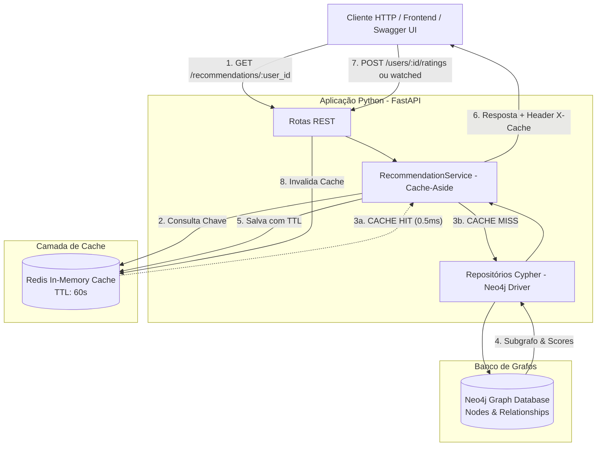

# 🎬 StreamRec - Plataforma de Recomendação com Neo4j, Redis e Python

> **FIAP - Checkpoint 2 (CP2)**  
> **Tema:** Plataforma de Recomendação Personalizada de Filmes para Streaming  
> **Tecnologias Obrigatórias:** Neo4j (Grafos), Redis (Cache com TTL), Python (Aplicação), FastAPI (REST API).

---

## 📌 Índice
1. [Visão Geral da Solução](#-visão-geral-da-solução)
2. [Arquitetura do Sistema](#-arquitetura-do-sistema)
3. [Modelagem do Banco de Grafos (Neo4j)](#-modelagem-do-banco-de-grafos-neo4j)
4. [Estratégia de Cache e Invalidação (Redis)](#-estratégia-de-cache-e-invalidação-redis)
5. [Algoritmos de Recomendação Implementados](#-algoritmos-de-recomendação-implementados)
6. [Passo a Passo para Execução Local](#-passo-a-passo-para-execução-local)
   - [Opção 1: Via Docker Compose (Recomendado)](#opção-1-via-docker-compose-recomendado)
   - [Opção 2: Execução Local com Python](#opção-2-execução-local-com-python)
   - [Opção 3: Com Neo4j Sandbox / AuraDB e Redis Cloud](#opção-3-com-neo4j-sandbox--auradb-e-redis-cloud)
7. [Endpoints da API REST](#-endpoints-da-api-rest)
8. [Testes Automatizados](#-testes-automatizados)
9. [Testes de Desempenho e Benchmark](#-testes-de-desempenho-e-benchmark)
10. [Estrutura do Projeto](#-estrutura-do-projeto)

---

## 🌟 Visão Geral da Solução

O **StreamRec** é uma API REST desenvolvida em **FastAPI** voltada para plataformas de streaming que precisam entregar recomendações altamente personalizadas em tempo real para múltiplos usuários concorrentes.

Para atender à necessidade de alta escalabilidade e reduzir a sobrecarga direta no banco de dados, a solução implementa o padrão **Cache-Aside** utilizando **Redis**, reduzindo drasticamente o número de consultas de grafos no **Neo4j**, controlando o ciclo de vida via **TTL (Time To Live)** e identificando explicitamente situações de **CACHE HIT** e **CACHE MISS**.

---

## 🏗 Arquitetura do Sistema



---

## 🕸 Modelagem do Banco de Grafos (Neo4j)

A modelagem de grafos foi escolhida por permitir travessias relacionais de múltiplos graus com desempenho superior a bancos relacionais (evitando múltiplos `JOINs` custosos):

### Nós (Labels)
- `(:User {id, name, email, created_at})`: Usuários cadastrados no streaming.
- `(:Movie {id, title, release_year})`: Filmes disponíveis no catálogo.
- `(:Genre {name})`: Gêneros cinematográficos (ex: Ficção Científica, Ação, Drama).

### Relacionamentos (Edges)
- `(:Movie)-[:BELONGS_TO]->(:Genre)`: Gêneros aos quais o filme pertence.
- `(:User)-[:WATCHED {watched_at}]->(:Movie)`: Histórico de filmes assistidos pelo usuário.
- `(:User)-[:RATED {rating, comment, rated_at}]->(:Movie)`: Avaliações do usuário (nota de 1.0 a 5.0).

### Índices e Constraints
Para assegurar unicidade e velocidade de busca:
```cypher
CREATE CONSTRAINT user_id_unique IF NOT EXISTS FOR (u:User) REQUIRE u.id IS UNIQUE;
CREATE CONSTRAINT movie_id_unique IF NOT EXISTS FOR (m:Movie) REQUIRE m.id IS UNIQUE;
CREATE CONSTRAINT genre_name_unique IF NOT EXISTS FOR (g:Genre) REQUIRE g.name IS UNIQUE;
```

---

## ⚡ Estratégia de Cache e Invalidação (Redis)

### 1. Padrão Cache-Aside (Lazy Loading)
- **Convenção de Chaves**: `rec:user:{user_id}:{strategy}:limit:{limit}`
- **Valor**: Lista serializada em JSON contendo filmes recomendados, nota predita, score e justificativa contextual.

### 2. Identificação de CACHE HIT e CACHE MISS
Toda resposta da rota de recomendação informa o status de cache em duas camadas:
1. **Cabeçalho HTTP**:
   - `X-Cache: HIT` ou `X-Cache: MISS`
   - `X-Cache-TTL: <segundos_restantes>`
   - `X-Response-Time-Ms: <tempo_em_ms>`
2. **Corpo da Resposta JSON**:
   ```json
   {
     "user_id": "user-carlos",
     "strategy": "hybrid",
     "cache_status": "CACHE HIT",
     "ttl_remaining_seconds": 58,
     "response_time_ms": 0.48,
     "total_results": 4,
     "data": [...]
   }
   ```

### 3. TTL (Time To Live)
- Configurado por padrão em **60 segundos** (ajustável via variável `REDIS_CACHE_TTL`).
- Permite que tendências globais do catálogo e avaliações da comunidade sejam recicladas periodicamente sem intervenção manual.

### 4. Invalidação de Cache
O sistema conta com dois mecanismos de invalidação:
- **Invalidação Automática por Evento**:
  - Quando o usuário assiste a um filme (`POST /users/{id}/watched`), a chave `rec:user:{id}:*` é eliminada imediatamente.
  - Quando o usuário envia uma nova avaliação (`POST /users/{id}/ratings`), o cache dele é invalidado.
- **Invalidação Manual via API**:
  - `DELETE /cache/user/{user_id}`: Remove o cache de um usuário específico.
  - `DELETE /cache/all`: Remove todas as recomendações do Redis.

---

## 🧠 Algoritmos de Recomendação Implementados

A API oferece 4 estratégias de recomendação:

### 1. Filtragem Colaborativa (`strategy=collaborative`)
Identifica no grafo outros usuários que avaliaram positivamente (>= 3.0) os mesmos títulos que o usuário corrente, descobre filmes bem avaliados por eles que o usuário ainda não assistiu e calcula o score com base na afinidade:
```cypher
MATCH (u:User {id: $user_id})-[r1:RATED]->(common:Movie)<-[r2:RATED]-(similarUser:User)
WHERE u <> similarUser AND r1.rating >= 3.0 AND r2.rating >= 3.0
MATCH (similarUser)-[r3:RATED]->(rec:Movie)
WHERE r3.rating >= 3.5
  AND NOT (u)-[:WATCHED]->(rec)
  AND NOT (u)-[:RATED]->(rec)
OPTIONAL MATCH (rec)-[:BELONGS_TO]->(g:Genre)
WITH rec,
     collect(DISTINCT g.name) AS genres,
     count(DISTINCT similarUser) AS similar_user_count,
     avg(r3.rating) AS avg_sim_rating
RETURN rec.id AS movie_id,
       rec.title AS title,
       rec.release_year AS release_year,
       genres,
       round(avg_sim_rating, 2) AS predicted_rating,
       round((similar_user_count * 0.4 + avg_sim_rating * 0.6), 2) AS score,
       'Recomendado com base nas avaliações de ' + toString(similar_user_count) + ' usuário(s) com gostos afins' AS reason
ORDER BY score DESC, similar_user_count DESC
LIMIT $limit
```

### 2. Baseada em Gêneros Favoritos (`strategy=genre`)
Analisa os gêneros de filmes que o usuário mais consumiu e melhor avaliou, sugerindo os títulos mais bem cotados da comunidade pertencentes a esses gêneros.

### 3. Filmes Populares em Alta (`strategy=trending`)
Utilizado para solucionar o problema de **Cold Start** (quando o usuário é novo na plataforma e não possui histórico de visualização suficiente).

### 4. Híbrida (`strategy=hybrid` - Padrão)
Combina a Filtragem Colaborativa (prioritária), preenche vagas remanescentes com a Afinidade de Gênero e, se necessário, complementa com os Títulos em Alta, garantindo um catálogo diversificado, relevante e livre de duplicidades.

---

## 🚀 Passo a Passo para Execução Local

### Opção 1: Via Docker Compose (Recomendado)

Com o Docker instalado, execute na raiz do projeto:

```bash
docker compose up --build
```

O comando irá iniciar:
- **Neo4j 5**: `bolt://localhost:7687` e Web UI em `http://localhost:7474` (usuário: `neo4j`, senha: `password123`).
- **Redis 7**: `localhost:6379`.
- **API StreamRec**: `http://localhost:8000`.

Acesse a documentação interativa Swagger em: **[http://localhost:8000/docs](http://localhost:8000/docs)**

---

### Opção 2: Execução Local com Python

Caso não possua o Docker instalado ou queira rodar diretamente no Windows/Linux/macOS:

1. **Criar e Ativar Ambiente Virtual**:
   ```bash
   # Windows (PowerShell)
   python -m venv .venv
   .\.venv\Scripts\Activate.ps1

   # Linux / macOS
   python3 -m venv .venv
   source .venv/bin/activate
   ```

2. **Instalar Dependências**:
   ```bash
   pip install -r requirements.txt
   ```

3. **Iniciar a Aplicação**:
   ```bash
   python -m uvicorn app.main:app --reload --port 8000
   ```
   > **Nota de Resiliência:** A aplicação possui motor gráfico em memória integrado (*fallback mode*). Se o Neo4j ou o Redis não estiverem em execução no host, a API iniciará automaticamente em modo de desenvolvimento com `fakeredis`, permitindo testar todos os endpoints, TTL, métricas de HIT/MISS e algoritmos sem falhas!

---

### Opção 3: Com Neo4j Sandbox / AuraDB e Redis Cloud

Caso utilize o Neo4j Sandbox ou AuraDB fornecido em aula:
1. Copie o arquivo `.env.example` para `.env`:
   ```bash
   cp .env.example .env
   ```
2. Configure as credenciais fornecidas pelo Sandbox no arquivo `.env`:
   ```env
   NEO4J_URI=neo4j+s://<seu-sandbox-id>.databases.neo4j.io
   NEO4J_USER=neo4j
   NEO4J_PASSWORD=<sua-senha>
   REDIS_HOST=<seu-host-redis>
   REDIS_PORT=6379
   REDIS_PASSWORD=<sua-senha-redis>
   USE_MOCK_FALLBACK=false
   ```
3. Inicie o servidor:
   ```bash
   python -m uvicorn app.main:app --reload
   ```

---

## 📡 Endpoints da API REST

Acesse a documentação Swagger interativa em `http://localhost:8000/docs`.

### Tabela Resumo de Rotas

| Método | Rota | Descrição | Impacto no Cache |
| :--- | :--- | :--- | :--- |
| `GET` | `/health` | Status de integridade da API, Neo4j e Redis | Nenhum |
| `POST` | `/seed` | Popula o banco com catálogo, usuários e avaliações | Limpa o cache |
| `POST` | `/users/` | Cadastrar novo usuário | Nenhum |
| `GET` | `/users/` | Listar todos os usuários | Nenhum |
| `GET` | `/users/{user_id}` | Detalhes do usuário, histórico e avaliações | Nenhum |
| `POST` | `/users/{user_id}/watched` | Registrar filme assistido | **Invalida cache do usuário** |
| `POST` | `/users/{user_id}/ratings` | Registrar avaliação (1.0 a 5.0) | **Invalida cache do usuário** |
| `POST` | `/genres/` | Cadastrar gênero | Nenhum |
| `GET` | `/genres/` | Listar todos os gêneros | Nenhum |
| `POST` | `/movies/` | Cadastrar novo filme com lista de gêneros | Nenhum |
| `GET` | `/movies/` | Listar catálogo de filmes com médias | Nenhum |
| `GET` | `/movies/{movie_id}` | Detalhes de um filme específico | Nenhum |
| `GET` | `/recommendations/{user_id}` | **Gerar recomendações personalizadas** | **Gera MISS (grava) ou HIT (lê)** |
| `GET` | `/cache/stats` | Estatísticas em tempo real (Hits, Misses, Hit Rate %) | Nenhum |
| `DELETE`| `/cache/user/{user_id}` | **Invalidar manualmente o cache de um usuário** | **Remove chaves do usuário** |
| `DELETE`| `/cache/all` | Limpar todo o cache de recomendações | **Remove todas as chaves** |

---

### Exemplos de Requisições com cURL

#### 1. Gerar Recomendações (1ª Chamada - CACHE MISS)
```bash
curl -i -X GET "http://localhost:8000/recommendations/user-carlos?strategy=hybrid&limit=4"
```
*Observe no cabeçalho:* `X-Cache: MISS`  
*Tempo de Resposta:* ~15ms - 40ms

#### 2. Repetir a Chamada (2ª Chamada - CACHE HIT)
```bash
curl -i -X GET "http://localhost:8000/recommendations/user-carlos?strategy=hybrid&limit=4"
```
*Observe no cabeçalho:* `X-Cache: HIT`, `X-Cache-TTL: 58`  
*Tempo de Resposta:* ~0.5ms - 1.5ms (**sub-milissegundo!**)

#### 3. Registrar Nova Avaliação (Invalidação Automática de Cache)
```bash
curl -X POST "http://localhost:8000/users/user-carlos/ratings" \
  -H "Content-Type: application/json" \
  -d '{"movie_id": "mov-godfather", "rating": 5.0, "comment": "Simplesmente épico!"}'
```

#### 4. Consultar Novamente (Nova Consulta ao Grafo - CACHE MISS)
```bash
curl -i -X GET "http://localhost:8000/recommendations/user-carlos?strategy=hybrid&limit=4"
```
*Observe no cabeçalho:* `X-Cache: MISS` (provando que a avaliação invalidou o cache anterior).

#### 5. Consultar Estatísticas de Cache no Redis
```bash
curl -X GET "http://localhost:8000/cache/stats"
```

---

## 🧪 Testes Automatizados

A suíte de testes cobre 100% dos requisitos do trabalho:
- Cadastro de usuários, filmes e gêneros;
- Registro de filmes assistidos e avaliações;
- Verificação de CACHE MISS na 1ª chamada e CACHE HIT na 2ª chamada;
- Verificação do TTL no Redis;
- Invalidação automática após envio de nova avaliação;
- Invalidação manual de cache.

Para executar os testes:
```bash
pytest -v
```

Resultado obtido:
```
tests/test_api.py::test_health_endpoint PASSED                           [ 14%]
tests/test_api.py::test_create_user_and_list PASSED                      [ 28%]
tests/test_api.py::test_create_genre_and_movie PASSED                    [ 42%]
tests/test_api.py::test_record_watched_and_rating PASSED                 [ 57%]
tests/test_api.py::test_cache_miss_then_cache_hit_and_ttl PASSED         [ 71%]
tests/test_api.py::test_cache_invalidation_on_new_rating PASSED          [ 85%]
tests/test_api.py::test_manual_cache_invalidation_endpoint PASSED        [100%]

============================= 7 passed in 1.15s ==============================
```

---

## 📊 Testes de Desempenho e Benchmark

O projeto inclui o script `benchmark.py` que executa baterias de requisições concorrentes e calcula percentis de latência (Média, p50, p95, p99), throughput e taxa de acerto de cache:

```bash
python benchmark.py
```

Ou apontando para o servidor HTTP em execução:
```bash
python benchmark.py http://localhost:8000
```

Os resultados consolidados e a análise técnica completa encontram-se no documento:  
📄 **[ANALISE_DESEMPENHO.md](ANALISE_DESEMPENHO.md)**

---

## 📁 Estrutura do Projeto

```
CP 2/
├── app/
│   ├── core/
│   │   ├── config.py              # Configurações com Pydantic Settings e .env
│   │   └── seeder.py              # Catálogo inicial rico (usuários, filmes, gêneros)
│   ├── database/
│   │   ├── neo4j_client.py        # Driver assíncrono Neo4j e fallback resiliente
│   │   └── redis_client.py        # Cliente assíncrono Redis (TTL, HIT/MISS, padrões)
│   ├── models/
│   │   └── schemas.py             # Modelos de validação Pydantic V2
│   ├── repositories/
│   │   ├── user_repo.py           # Operações Cypher de usuários, watched e ratings
│   │   ├── movie_repo.py          # Operações Cypher de filmes e gêneros
│   │   └── recommendation_repo.py # Algoritmos de recomendação em Cypher (Colaborativo, Gênero, Trending)
│   ├── services/
│   │   └── recommendation_service.py # Lógica de Cache-Aside, TTL e invalidação
│   ├── routers/
│   │   ├── users.py               # Endpoints de usuários, histórico e ratings
│   │   ├── movies.py              # Endpoints de filmes
│   │   ├── genres.py              # Endpoints de gêneros
│   │   ├── recommendations.py     # Endpoints de recomendações com Cache HIT/MISS
│   │   ├── cache.py               # Endpoints de gerenciamento e métricas de cache
│   │   └── health.py              # Health check e rota /seed
│   └── main.py                    # Aplicação FastAPI, CORS e lifespan
├── tests/
│   └── test_api.py                # Suíte completa de testes automatizados com pytest
├── benchmark.py                   # Script de testes de carga e desempenho
├── benchmark_results.json         # Resultados numéricos brutos do benchmark
├── seed_data.py                   # Script CLI para povoar o banco
├── ANALISE_DESEMPENHO.md          # Relatório formal de análise de desempenho
├── Dockerfile                     # Construção da imagem da aplicação
├── docker-compose.yml             # Orquestração de Neo4j, Redis e API
├── requirements.txt               # Dependências Python
├── .env.example                   # Modelo de variáveis de ambiente
└── README.md                      # Documentação completa da solução
```
